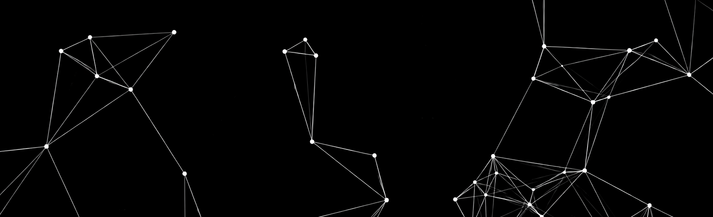

<!-- Banner -->

  

<h1 align="center">
  🌸 Hi, I'm <strong>Kasia Stańczyk</strong> 🌙
</h1>

  🎨 <strong>Graphic</strong> & 💻 <strong>Aspiring Software Developer</strong> 
  📍 Poland | 🎓 CS student — University of Łódź  
  🌱 I love creating things that not only <strong>work</strong>, but also <strong>look magical</strong>.

## 💡 About Me
I combine **creativity with technology**
— studying **Applied Computer Science** (specializing in *Programming and Algorithms*) while exploring both **visual design** and **software development**.
- 🖌️ I design promotional graphics & user interfaces  
- 📱 I run social media for my faculty 
- 💻 I code in **C++**, **Python**, and explore **frontend** technologies  
- 🛠️ Gaining experience in **databases** and **operating systems**

---

## 🔍 Looking For
An **internship** opportunity where I can grow in both **design** and **development**, collaborate on meaningful projects, and continue learning from inspiring teams.

---

## 🛠️ Tech & Tools

**Languages:**  

**Design:**  
      

**IDE:**  
        

**Other Tools:**  
      

## 📊 GitHub Stats

  
  

## 🤝 Let's Connect!

  
  
  

_Thanks for visiting my profile — feel free to reach out or ⭐ one of my future projects!_
