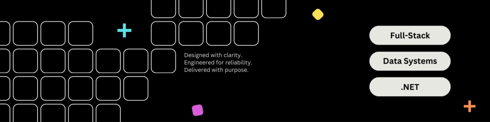

  

 

  

  <strong>Graphic</strong> & <strong>Aspiring Software Developer</strong> 
  📍 Poland | 🎓 CS student — University of Łódź   
  Reliable code. Thoughtful design. A little sparkle ✨   

  
  
  
  
    
  Coffee-powered ☕

 
<h2 align="center" style="font-size:28px; font-weight:bold;">About Me</h2>

I combine **creativity with technology** — studying **Applied Computer Science** (specializing in *Programming and Algorithms*) while exploring both **visual design** and **software development**.  

- I design **promotional graphics** and **user interfaces**
- I run **social media** for my faculty
- I code in **C++** and **Python**, and explore **frontend** technologies
- I’m gaining experience with **databases** and **operating systems**
 
<h2 align="center" style="font-size:28px; font-weight:bold;">My Skills</h2>

<h3 align="center">Core</h3>

  
  
  
  

<h3 align="center">Backend</h3>

  
  
  
  
  

<h3 align="center">Frontend</h3>

  
  
  
  
  
  
  
  
  

<h3 align="center">Data</h3>

  
  
  
  
  
  
  

<h3 align="center">Dev Tools</h3>

  
  
  
  
  
  
  

<h3 align="center">IDE</h3>

  
  
  
  
  

<h3 align="center">Creative / 3D</h3>

  
  
  
  
  
  

  

<h2 align="center" style="font-size:28px; font-weight:bold;">Stats</h2>

  
  

  

    

  <em>Thanks for visiting my profile — feel free to reach out or ⭐ one of my future projects!</em>

