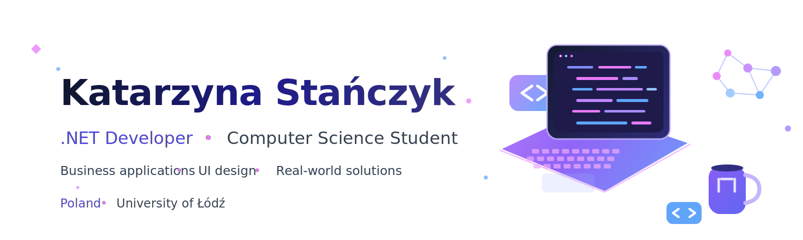

  

 

 

 

  

  

  
  
  
  

    

 

<h2 align="center" style="font-size:28px; font-weight:bold;">About Me</h2>

  I’m an <strong>Applied Computer Science student</strong> at the <strong>University of Łódź</strong>, specializing in <strong>Programming and Algorithms</strong>.

  I’m growing as a <strong>.NET Developer</strong>, with a focus on <strong>business applications</strong>, <strong>databases</strong>, <strong>clean UI</strong>, and practical software solutions.

  I enjoy combining <strong>technical problem-solving</strong> with <strong>visual design</strong> — building applications that are not only working, but also clear, useful, and pleasant to use.

  Currently, I work mostly with <strong>C#</strong>, <strong>.NET</strong>, <strong>SQL</strong>, <strong>Entity Framework Core</strong>, and frontend technologies such as <strong>Angular</strong> and <strong>React</strong>.

 

 
 
<h2 align="center" style="font-size:28px; font-weight:bold;">My Skills</h2>

<h3 align="center">Core</h3>

  
  
  
  
  

<h3 align="center">Backend</h3>

  
  
  
  
  

<h3 align="center">Frontend</h3>

  
  
  
  
  
  
  
  
  

<h3 align="center">Data</h3>

  
  
  
  
  
  
  

<h3 align="center">Dev Tools</h3>

  
  
  
  
  
  
  

<h3 align="center">IDE</h3>

  
  
  
  
  

<h3 align="center">Creative / 3D</h3>

  
  
  
  
  
  

  

<h2 align="center" style="font-size:28px; font-weight:bold;">Stats</h2>

  
  

  

    

  <em>Thanks for visiting my profile — feel free to reach out or ⭐ one of my future projects!</em>

